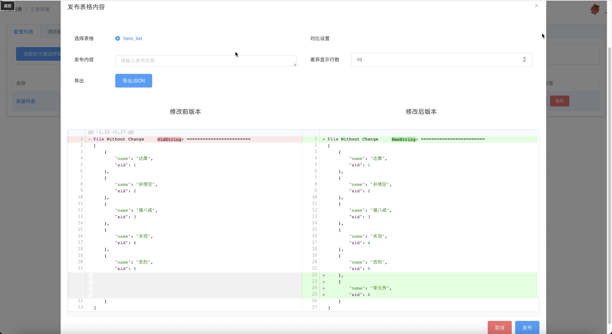
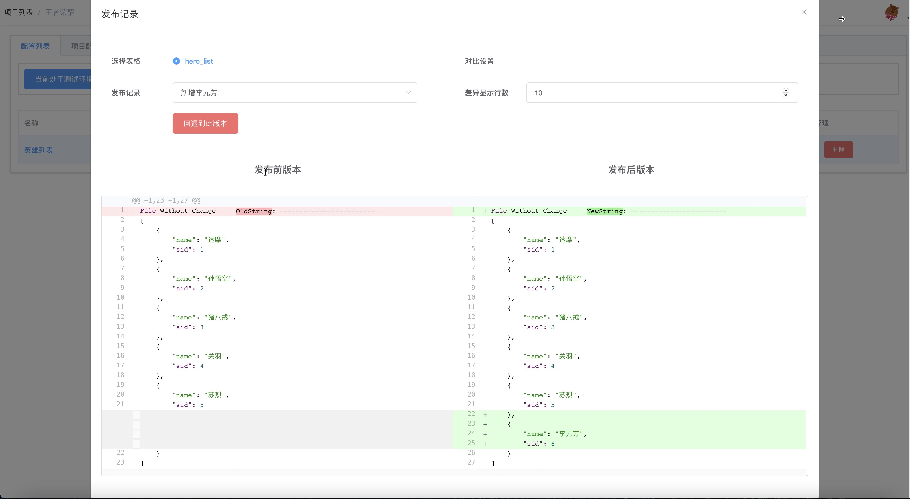

# 发布与回退

Excel按照规定格式编辑好之后，可以点击发布按钮将配置发布到数据库，发布配置有几个前提条件要满足

1. 配置好数据仓库
2. 配置表格式正常
3. 已经配置好数据

## 发布

点击发布按钮之后弹出的界面左边会显示数据库当前版本的数据，右边会显示Excel里最新的配置数据，发布就会将右边的数据导入数据库。多个sheet的配置表，可以切换比对。发布内容为必填项，简要描述改动的内容即可，点击右下角发布按钮，会把配置同步到数据仓库里，并且会在发布记录里面新增一条记录。

新增一条配置的差异对比效果

## 发布记录与回退

每次发布都会在发布记录里面增加一条记录，点击记录按钮即可查看配置发布的记录，可以查看每次发布修改的内容，并且支持一键回退到某个记录的版本，回退版本同样会在发布记录里面新增一条记录，可以看到回退的操作。

## 发布顺序

左边的数据是从数据仓库里读取，如果是接入了databus，则是通过RPC从应用服务的e2cdatabus拉取，如果配置了多个数据仓库，那么会按照Mysql -> Redis -> Databus的顺序依次读取，读到即返回，更新的时候也是按照顺序依次更新。

