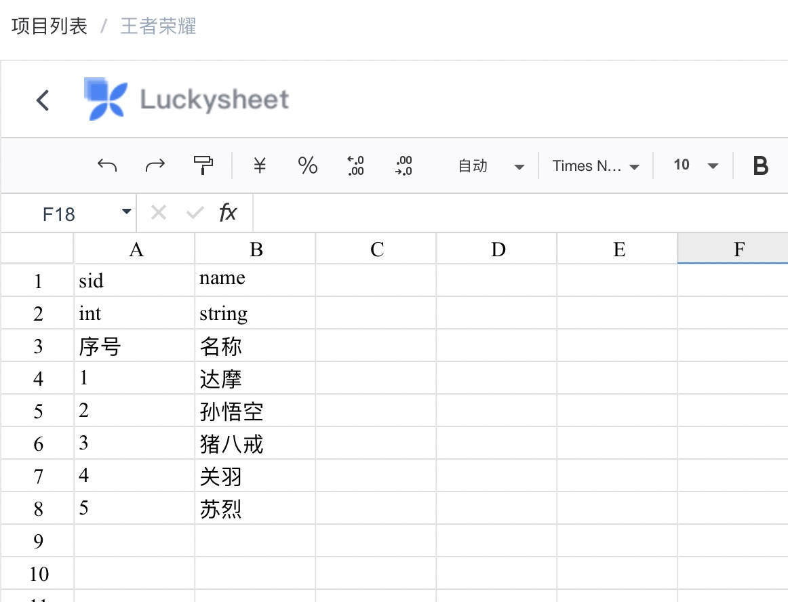
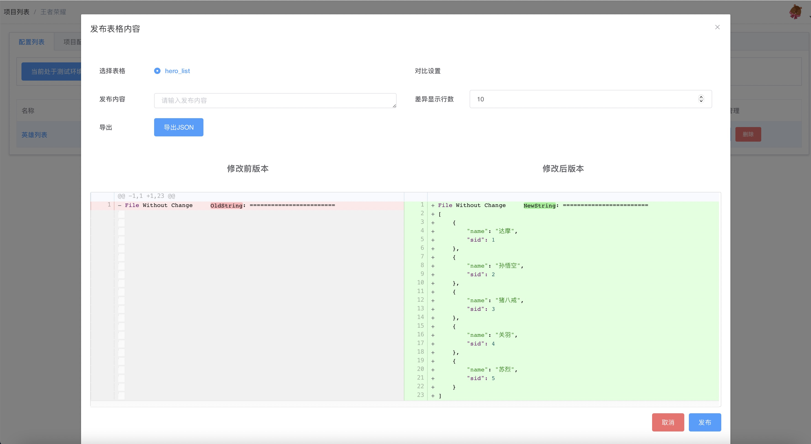

# Excel管理


Excel是同类型配置的一个集合，Excel的命名支持中文和英文，支持填写备注，创建之后名称不允许修改，备注可以修改。

同类型的配置在一个Excel里面以不同sheet的形式存在，每个sheet均代表一张配置表


## 配置表结构

Excel想要描述配置，必须对配置结构、数据类型进行定义，所以表格必须按照一定的规则来编写，所以配置表分为表头和表内容两个部分，表头具体为：

```json
配置表头分为三行
1、第一行是字段名，用英文表示
2、第二行是字段类型，int代表数值类型，string代表字符串类型
3、第三行是字段备注，中英文均可，建议不超过30个字
```

表内容就按照表头的结构填充内容，表结构第一列必须是不重复的ID，如果选用MySQL作为数据仓库，会把配置表第一列做为表的主键，所以不允许重复，且不允许使用`string`类型，因为string类型在MySQL中会转换成`TEXT`类型，Mysql不支持`TEXT`类型的数据做主键。


我们在英雄列表里面新建一个sheet，命名为`hero_list`，填充表内容为：




点击左上角 `<` 返回配置列表，点击发布，即可看到导出的JSON数据



