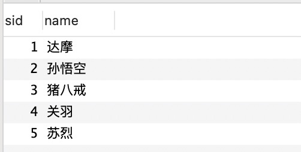
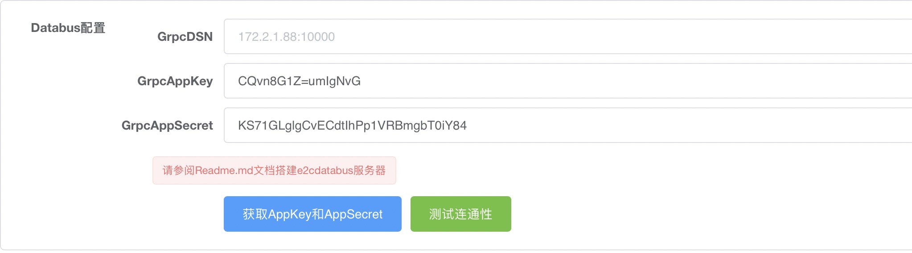

# 项目管理

Excel2Config设计之初就定义成了一个配置管理平台，支持多个项目接入进来，每个项目可以设置独立的数据仓库，独立管理项目成员。


## 项目配置


首次登录系统，需要联系项目管理员添加你自己到现有项目，也可以自己创建一个项目，拉取其他用户到项目里来。目前无法查看自己没有参与的项目，为了避免重复创建项目，建议由团队内的一个人创建项目，其他人登录系统之后，把用户名告知创建者，由创建者拉进团队。


项目创建完成之后，有如下几项配置：

1. 授权访问token，用于开放API的访问认证
2. 数据仓库，目前支持三种数据仓库
   1. MySQL数据库
   2. Redis数据库
   3. Databus（需要项目方接入[e2cdatabus](https://github.com/fandypeng/e2cdatabus)）

### MySQL作为数据仓库


数据仓库中勾选了Mysql之后，可以看到MysqlDSN这一输入框，这是MySQL连接配置的语句，格式如下：

`username:password@tcp(127.0.0.1:3306)/dbname?charset=utf8mb4`


Excel中一个sheet对应一个配置表，参见 [Excel管理](excel_manage.md) 里的示例，配置表 `hero_list` JSON结构如下：

```json
[
    {
        "name": "达摩",
        "sid": 1
    },
    {
        "name": "孙悟空",
        "sid": 2
    },
    {
        "name": "猪八戒",
        "sid": 3
    },
    {
        "name": "关羽",
        "sid": 4
    },
    {
        "name": "苏烈",
        "sid": 5
    }
]
```


对应到MySQL里的表结构就是：

```
CREATE TABLE `hero_list` (
  `sid` bigint(20) NOT NULL COMMENT '序号',
  `name` text NOT NULL COMMENT '名称',
  PRIMARY KEY (`sid`)
) ENGINE=InnoDB DEFAULT CHARSET=utf8mb4;
```

导表之后的数据为：




配置表里的int类型在MySQL里面设置成了BIGINT(20)，string类型被设置成了TEXT类型。

第一列数据`sid`被设置成了表的主键，所以配置表的第一列必须满足作为主键的要求，不允许重复，不允许设置成string类型。


### Redis作为数据仓库


数据仓库中勾选了Redis之后，可以看到RedisDSN、密码、KeyPrefix三个输入框，其中RedisDSN的配置格式为：

`127.0.0.1:6379`

如果设置了Redis的密码，那就需要将密码填入密码输入框，如果设置了Key前缀，那就需要将Redis填入KeyPrefix输入框，默认情况下是无密码无前缀的


Redis作为数据仓库，配置表的数据使用KV结构来存储，sheet的名称作为Redis里的key，value就是导出的JSON字符串

```shell
127.0.0.1:6379> get hero_list
[{"name":"达摩","sid":1},{"name":"孙悟空","sid":2},{"name":"猪八戒","sid":3},{"name":"关羽","sid":4},{"name":"苏烈","sid":5}]
```


### Databus作为数据仓库


如果部署Excel2Config的服务器无法访问应用服务的数据库，那么发布配置数据就需要经过一层数据中转才可以存入数据库，这个数据中转的角色就是e2cdatabus，目前e2cdatabus只有go的版本。

应用服务器接入e2cdatabus，并将MySQL或者Redis的连接配置传递给e2cdatabus，Excel2Config通过RPC请求将配置数据传递到e2cdatabus，由e2cdatabus保存到数据库，数据库格式跟上面的格式定义一致。

为了保证RPC通信过程中的数据安全，第三方接入e2cdatabus的时候，需要使用Excel2Config平台分配的AppKey和AppSecret，项目管理Databus配置里可以点击按钮生成AppKey和AppSecret，保存之后AppKey和AppSecret就不允许再次修改，如果Key遭到泄露，可以点击按钮重新生成，再次保存即可重置掉。





## 授权访问token


授权访问token用于外部服务通过API接入Excel2Config的场景，项目配置里面有刷新AccessToken的按钮，每次点击均会生成新的token，保存之后非必要不允许修改。


目前只对外提供了一个获取Excel配置数据的API

API地址：/excel/export_all_sheets

| 参数名                | 参数类型 | 备注                      |
| --------------------- | -------- | ------------------------- |
| [gridKey](concept.md) | string   | Excel的唯一ID             |
| accessToken           | string   | 每个项目唯一的AccessToken |

返回值：

```json
{
    "code": 0,
    "message": "0",
    "ttl": 1,
    "data": {
        "sheetList": [
            {
                "name": "hero_list",
                "content": "[{\"name\":\"达摩\",\"sid\":1},{\"name\":\"孙悟空\",\"sid\":2},{\"name\":\"猪八戒\",\"sid\":3},{\"name\":\"关羽\",\"sid\":4},{\"name\":\"苏烈\",\"sid\":5}]"
            }
        ]
    }
}
```

